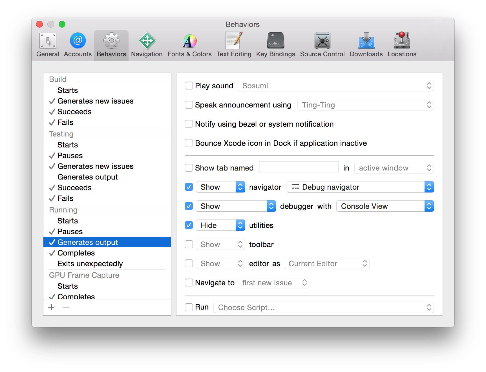
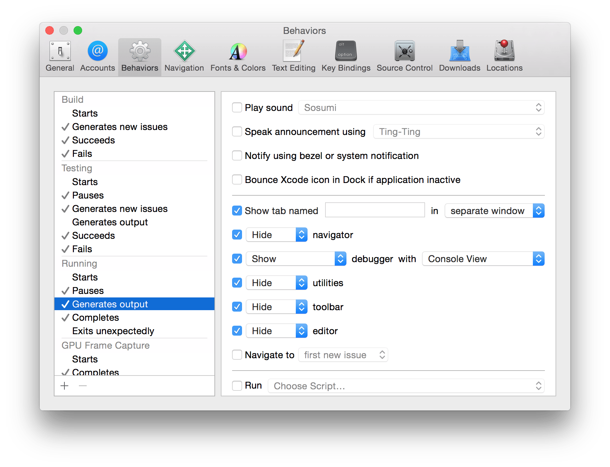
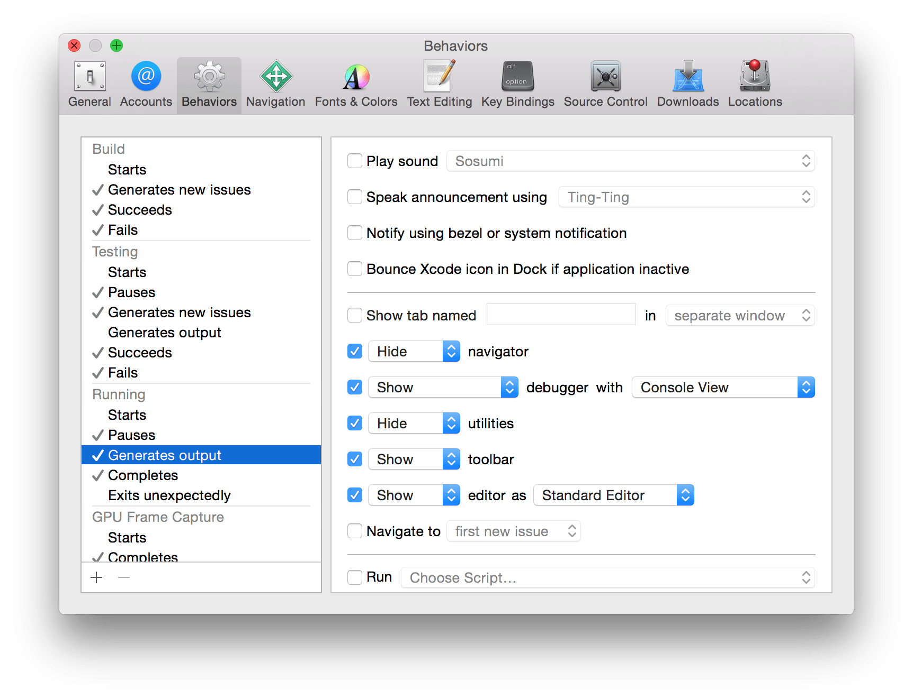
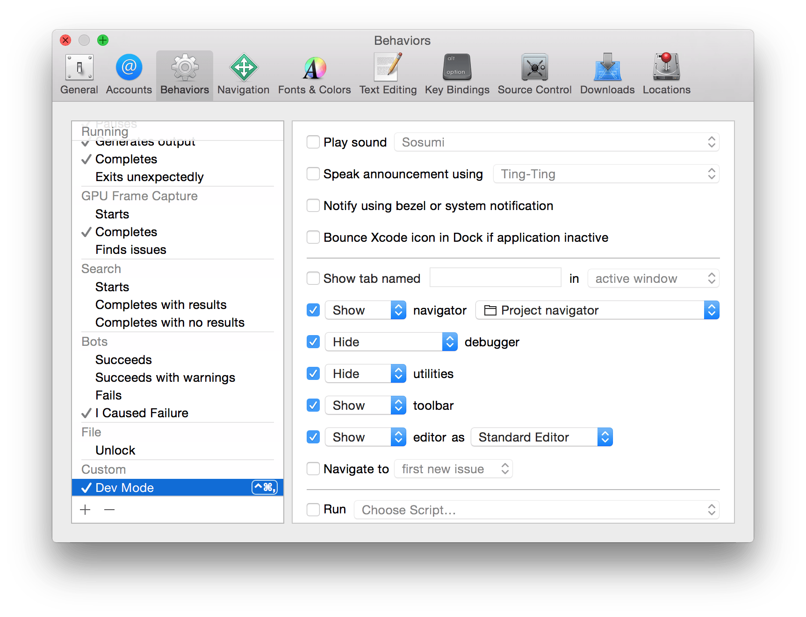

# 通过Behaviors控制Xcode的行为

> 前言：在xcode中运行app时，底部的调试区就会随之出现，这就是通过xcode的**Behaviors**实现的。

 

### 一. Behaviors简介

可以通过 Xcode -> Behaviors -> Edit Behaviors，打开 Behaviors 偏好设置，如下图所示：**它是一系列事件和动作的集合，可以设置当某个事件发生时，执行哪些动作。**

> 注：“运行app时，随之出现调试区”，就是在 Running 下的 "Generates output" 事件发生时，执行 "Show debugger with Current Views" 动作实现的。

 

### 二. 一些实用的行为

**1. 在xcode中运行app时，将调试区显示在另一个屏幕（适用多屏开发）**，设置如下图所示：

**2. 在xcode中运行app时，最大化调试区（适用单屏开发）**，设置如下图所示：

**3. 自定义行为**

通过点击Behavior偏好设置的左下角的“+”来添加一个 **自定义行为**，你可以给 **自定义行为** 设置快捷键并指定相应的动作或自定义脚本，从而一键完成一些常用操作。

下图中定义了一个自定义行为，在按下 `command + ctrl + ,` 键后，xcode工具条以下部分将只显示左侧导航条和编辑区：

